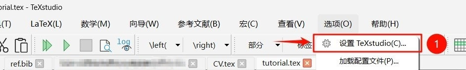
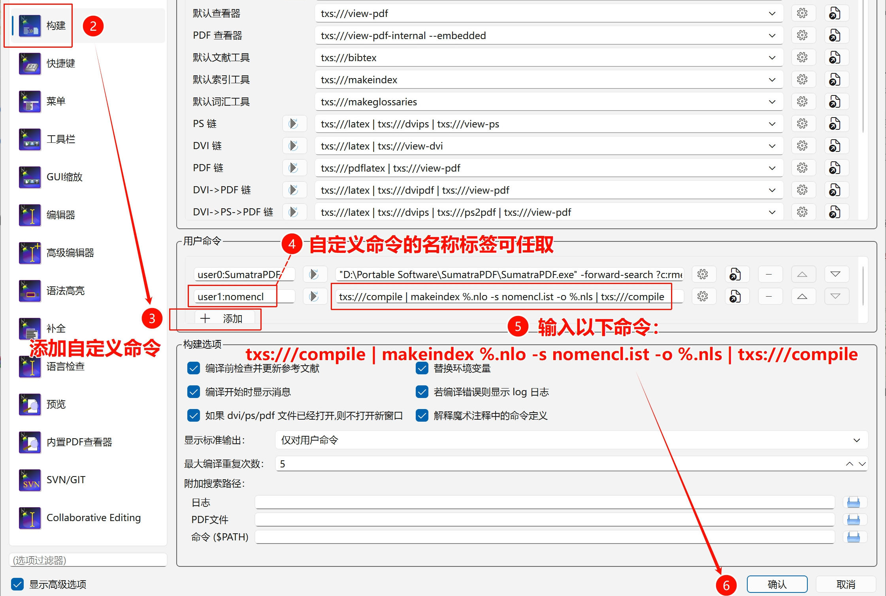
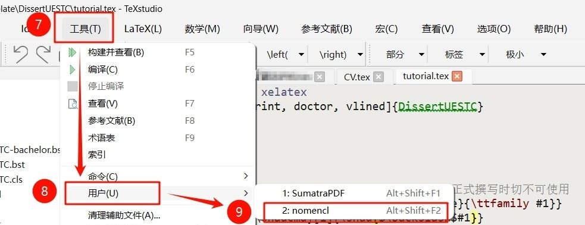
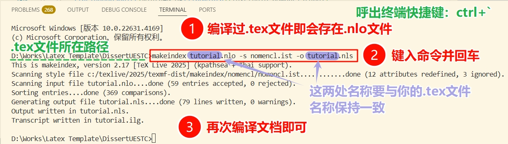
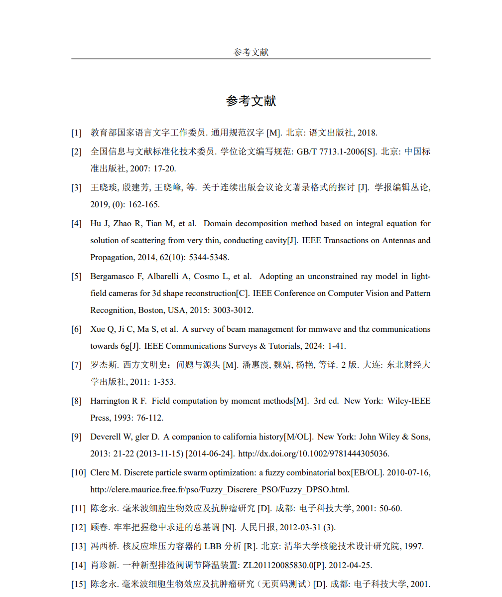
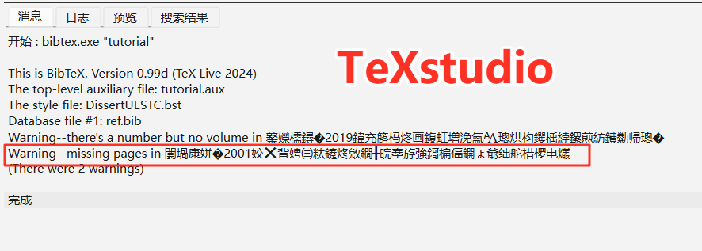
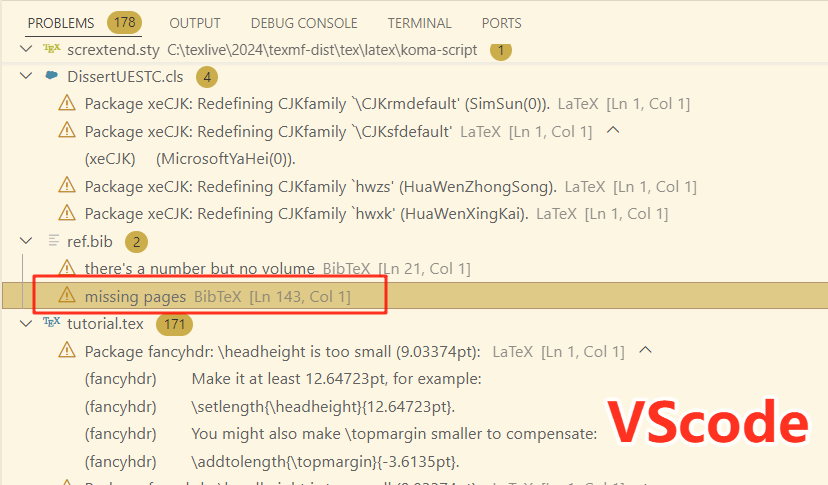

**简体中文** | [English](./readme_en.md)

<h1 align="center"> 电子科技大学学位论文模板2024 </h1>
<div align="center">
  <a href="https://www.latex-project.org/lppl/">
    
  </a>
  <a href="https://github.com/MGG1996/DissertationUESTC/stargazers">
    
  </a>
  <a href="https://github.com/MGG1996/DissertationUESTC/forks">
    
  </a>
  <a href="https://github.com/MGG1996/DissertationUESTC/issues">
    
  </a>
</div>
<div align="center">
  <a href="https://github.com/MGG1996/DissertationUESTC/releases">
    
  </a>
  <a href="https://github.com/MGG1996/DissertationUESTC/releases/latest">
    
  </a>
</div>


- [1. 前言](#1-前言)
  - [1.1 适用对象](#11-适用对象)
  - [1.2 使用环境](#12-使用环境)
  - [1.3 模板完成度](#13-模板完成度)
  - [1.4 模板的更新方法](#14-模板的更新方法)
  - [1.5 开发该模板的原因](#15-开发该模板的原因)
  - [1.6 鸣谢](#16-鸣谢)
  - [1.7 免责声明](#17-免责声明)
  - [1.8 项目统计](#18-项目统计)
- [2. 导言区](#2-导言区)
- [3. 论文封面及扉页](#3-论文封面及扉页)
  - [3.1 保密标识（2025.01.07）](#31-保密标识20250107)
  - [3.2 封面](#32-封面)
    - [3.2.1 “双学位学士”以外的论文封面](#321-双学位学士以外的论文封面)
    - [3.2.2 “双学位学士”论文封面](#322-双学位学士论文封面)
  - [3.3 中文扉页（仅研究生）](#33-中文扉页仅研究生)
  - [3.4 英文扉页（仅研究生）](#34-英文扉页仅研究生)
- [4. 独创性声明（仅研究生）](#4-独创性声明仅研究生)
- [5. 中英文摘要](#5-中英文摘要)
- [6. 目录，图目录，表目录，主要符号表，缩略词表](#6-目录图目录表目录主要符号表缩略词表)
- [7. 论文主体部分](#7-论文主体部分)
  - [7.1 写在最前面（2025.01.07）](#71-写在最前面20250107)
  - [7.2 各级标题](#72-各级标题)
  - [7.3 图片](#73-图片)
  - [7.4 表格](#74-表格)
    - [7.4.1 普通表格](#741-普通表格)
    - [7.4.2 带附注表格](#742-带附注表格)
    - [7.4.3 跨页表格](#743-跨页表格)
    - [7.4.4 跨页带附注表格（2025.01.05）](#744-跨页带附注表格20250105)
  - [7.5 伪代码](#75-伪代码)
  - [7.6 定义，公理，定理，命题，推论，引理，示例，假设，注和证明](#76-定义公理定理命题推论引理示例假设注和证明)
  - [7.7 脚注](#77-脚注)
  - [7.8 模板中的各种编号](#78-模板中的各种编号)
  - [7.9 排版及微调数学公式](#79-排版及微调数学公式)
  - [7.10 在标题中排版数学符号](#710-在标题中排版数学符号)
  - [7.11 排版化学方程式](#711-排版化学方程式)
  - [7.12 引用](#712-引用)
- [8. 致谢](#8-致谢)
- [9. 参考文献](#9-参考文献)
- [10. 附录](#10-附录)
- [11. 攻读学位期间取得的成果（原则上仅研究生）](#11-攻读学位期间取得的成果原则上仅研究生)
- [12. 外文资料原文（仅本科生）](#12-外文资料原文仅本科生)
- [13. 外文资料译文（仅本科生）](#13-外文资料译文仅本科生)


## 1. 前言

### 1.1 适用对象

本模板参照以下电子科技大学官方规范编写：

* [研究生学位论文撰写规范（最后修订：2025.09.03）](https://gr.uestc.edu.cn/xiazai/114/3917)
* [关于启动2021级本科毕业设计（论文）工作的通知（发布时间：2024.10.09）](https://www.sice.uestc.edu.cn/info/1140/14689.htm)
* [交叉复合型毕业设计（发布时间：2022.03.25）](https://www.jwc.uestc.edu.cn/info/1507170256521551874)

适用对象包括：
> :white_check_mark: 学术学位博士 :mortar_board: 、专业学位博士 :mortar_board:
> 
> :white_check_mark: 学术学位硕士 :mortar_board: 、专业学位硕士 :mortar_board:
> 
> :white_check_mark: 普通学士 :mortar_board: 、**双学位学士（2025.04.21新增）** :mortar_board:
> 
> :white_check_mark: **来华留学生International Students（2025.01.07新增）** :mortar_board:

使用本模板需要掌握基本的LaTeX排版操作，本文档不会阐述如何使用常见的LaTeX命令和环境。如果你是纯新手，那可以先看看[一份（不太）简短的LaTeX2ε介绍](https://ctan.math.utah.edu/ctan/tex-archive/info/lshort/chinese/lshort-zh-cn.pdf)，它足以帮助你建立起基本概念，进而顺利使用本模板。

另外，本文档及`tutorial.tex`示例文档中**明确标注了`仅学士`、`仅研究生`或`仅专业学位`的内容只能由相应的同学使用，其他人应该注释或删除与自己无关的内容**。

### 1.2 使用环境

本模板的开发测试环境是`TeXLive2024 + TeXstudio`以及`TeXLive2024 + VSCode`，**兼容Windows、MacOS以及Overleaf等主流平台** :clap:。

:warning: 本地用户请务必将LaTeX环境更新到[TeXLive2024及以上](https://mirrors.tuna.tsinghua.edu.cn/tex-historic-archive/systems/texlive/)或[MacTeX2024及以上](https://mirrors.tuna.tsinghua.edu.cn/tex-historic-archive/systems/mactex/)，以避免兼容性问题。

* [:link: TeXLive安装教程](https://zhuanlan.zhihu.com/p/389394015)、[:link: MacTeX安装教程](https://blog.csdn.net/ChrisP_333/article/details/82943508)
* [:link: TeXstudio下载地址](https://texstudio.sourceforge.net/#download)、[:link: VSCode下载地址](https://code.visualstudio.com/Download)、[:link: VSCode配置LaTeX环境](https://zhuanlan.zhihu.com/p/166523064)

:warning: 模板需要使用`XeLaTeX`引擎进行编译：

* 若使用TeXstudio编辑器，则不需要进行额外设置：`tutorial.tex`文件在首行设置了`% !TEX Program = xelatex`，该指令指定使用`XeLaTeX`引擎编译该文档；
* VSCode编辑器和Overleaf无法识别上述命令，需要自行将编译引擎设置为`XeLaTeX`。

为了确保在Windows、MacOS、Overleaf等平台上编译出完全一致的结果，模板内置了所有用到的字体文件，这导致项目大小超出了Overleaf上传压缩包的限制。因此，Overleaf用户需要进行另一番操作： :bulb: **先在Overleaf上新建一个空项目，然后解压本模板并拖拽文件和文件夹到新建的项目中即可**。 :exclamation: **<font color=#8b0000>切记网站里要选TeXLive2024**，经测试，目前线上的TeXLive2025反而无法编译出正确的`主要符号表`和`缩略词表`页眉，原因不明</font>。本地2024及以上的TeXLive均无任何问题！

**提醒**：**<font color=#8b0000>Overleaf近期似乎收紧了普通账号的编译时间限制</font>**，而模版需要完整编译4次才能建立缩略词表、交叉引用等信息，因此普通账号在Overleaf上会编译超时。所以：<font color=#8b0000>1）要么，搭建自己的本地环境，最稳妥；2）要么，升级Overleaf的高级账号；3）要么，用第三方的Overleaf平台</font>，这里推荐一个：[OnlineLaTeX](https://www.onlinelatex.com/home/)。如果你既想用Overleaf，又不想升级高级账号或是用第三方平台，那只能用由网友[@note286](https://github.com/note286)提供的方法：**<font color=#8b0000>在模版根目录新建名为`latexmkrc`的文件，内容为`$max_repeat = 1;`</font>**。其原理是每次点击编译按钮后，让Overleaf只进行单次XeLaTeX编译，而不是默认的多次编译，这样只要单次编译时长不超过限制即可正常使用。代价是<font color=#8b0000>需要用户手动编译3次生成`缩略词表`，4次建立交叉引用</font>。自此提醒添加之日起，模版发布将分为常规版和Overleaf特别版，**后者提供了`latexmkrc`文件，仅针对想使用官方Overleaf又不想升级高级会员的用户**。（2026.01.03）


### 1.3 模板完成度

模板已经实现了学位论文撰写规范中近乎全部的排版要求，仅有两处并未实现且暂无计划 :sweat_smile:：

:anger: 未实现将图片附注排版在图题之下的功能。原因是未能找到实现该操作的LaTeX宏包，且本人能力有限，缺少实现该功能的思路。 :bulb: 替代方案是使用脚注，即通过`\footnotemark`和`\footnotetext`相互配合，细节参见[LaTeX脚注@Xovee](https://blog.csdn.net/xovee/article/details/127563209 "\footnotemark、\footnotetext配合使用")。或者，干脆避免在图中使用附注，改为在文中解释。

:anger: 伪代码环境不支持跨页排版。本模板排版伪代码使用的宏包是[algorithm2e](https://mirrors.sustech.edu.cn/CTAN/macros/latex/contrib/algorithm2e/doc/algorithm2e.pdf)，它无法跨页排版伪码。 :bulb: 通常来说，伪码跨页会增加阅读难度。反之，根据算法逻辑将之拆分成数个子算法或子过程，分别进行排版，最后再汇总，这可能是更合适的做法。

此外，不排除模板存在一些细节上的疏漏，各位在使用中若发现或遇到问题，欢迎来 :bug: [项目Issue页](https://github.com/MGG1996/DissertationUESTC/issues):bug: 进行反馈。若确为模板问题，我会在闲暇时尽量修复并进行更新。 :sparkles: 在此之前，请使用本模板（尤其是从学长处继承本模板）的同学先来、常来 :gift: [项目发布页](https://github.com/MGG1996/DissertationUESTC) :gift: 看看，确保自己使用的是最新版本 :satisfied:。

### 1.4 模板的更新方法

:bulb: 更新模板的正确方式：**下载最新的完整压缩包，解压后用自己的`.bib`和`.tex`文件以及`fig`目录替换掉模板中原有的同名文件和目录**。

:+1: 更建议的更新方式：**<font color=#8b0000>在初次使用本模板时，修改`.tex`和`.bib`文件的文件名（别忘了`.tex`文件内通过`\bibliography{}`设置的`.bib`文件名），后续只需下载最新的模板，并将其内容全部复制到论文所在的目录进行替换</font>**。

### 1.5 开发该模板的原因

距离**王稳**学长发布[thesisuestc](https://github.com/bdebye/thesisuestc "王稳成电模板")已经过去几年了，学校的撰写规范时有调整。例如在封面页、扉页等部分，[thesisuestc](https://github.com/bdebye/thesisuestc "王稳成电模板")的排布结构虽大体与新规范一致，但部分页面元素的相对距离、大小等细节却与新规范有不少出入。**我的本意是按照最新的撰写规范设计与之相对应的LaTeX模板，而非复刻[thesisuestc](https://github.com/bdebye/thesisuestc "王稳成电模板")**。

更重要的是，本模板希望提供 :sparkles: **更完备的内容排版能力** :sparkles: ，同时提供 :sparkles: **更丰富的人性化功能** :sparkles: ，以减少使用者消耗的精力：

1. 本模板提供了印刷模式。该模式会根据学校的印刷规范自动在论文前置部分的必要位置插入空白页，无需人为处理编译后的文档，彻底避免出错。

2. 本模板提供了评审模式。该模式将隐去所有身份信息，包括导师信息以及独创性声明中的签名和日期，以便送审。

3. 本模板提供了查重模式。该模式将使用等尺寸的矩形框线替换论文中的所有图片，以在个人查重时尽可能保证数据安全性。

4. 本模板可显式提醒超页问题。规范对“中文摘要”和“致谢”的篇幅做出了限制，当这些内容超出了对应的篇幅限制时，模板将通过打印信息来提醒使用者。

5. 在“封面”和“英文扉页”中，本模板可根据输入内容的实际长度自动确定需生成的下划线数量，灵活性和适应性较强。

6. 除了“中英文摘要”和“目录”等必要的前置内容，本模板还完整提供了“图目录”、“表目录”、“主要符号表”、“缩略词表”等可选前置部分。

7.  本模板提供了更强大的表格排版能力，支持排版“跨页带附注表格”；模板封装了额外的伪码环境，允许使用者根据实际情况灵活调整伪码区域的左右缩进。

8. 本模板支持半自动生成形如`(1-1a)`的递增子公式编号。该编号常见于数学模型的各约束，虽然可使用`\tag{}`命令显示指定某条约束的编号，但该方式操作繁琐，且在需要调换或增删约束时容易漏改tag，造成子公式编号混乱。本模板可彻底避免这种情况。

9.  本模板优化了`.bst`文件的处理逻辑。它可自动确定参考文献编号的最大长度，从而调整文献条目的悬挂缩进距离，保证产生齐整的文献内容左边界。

10. 本模板尽可能使用LaTeX风格编写`.cls`文件，内容更易于理解。同时，该文件中留存了大量详细的注释内容，对有特殊需求或需要微调模板的使用者更加友好。


### 1.6 鸣谢

非常感谢**王稳**学长设计的[thesisuestc](https://github.com/bdebye/thesisuestc "王稳成电模板")，它一直是成电毕业生撰写学位论文的首选。也因为该模板，本人产生了自行设计学位论文模板的想法并将之付诸行动。在设计模板的过程中，本人也借鉴了**王稳**学长的部分设计思路，实属站在前人的肩膀上，才在磕磕绊绊中将模板迭代到现今的程度。

此外，非常感谢广大网友在各种网站（StackExchange，知乎、CSDN、博客园等）上分享的LaTeX相关知识。仅以我个人的能力，要设计出完备的LaTeX模板定然困难重重、周期漫长。


### 1.7 免责声明

:warning: `tutorial.tex`文件中用于举例的各图片均来自于网络，如有侵权，请图片作者联系我进行删除。

:warning: 另外，为了全平台的通用性，模板内置了一些必要的字体。虽然Windows系统本就安装了某些字体，但实际上它们并不可商用，本模板的使用者需要注意该问题。


### 1.8 项目统计

[](https://www.star-history.com/#MGG1996/DissertationUESTC&bdebye/thesisuestc&shifujun/UESTCthesis&Date)


## 2. 导言区

模板的导言区只有两行：
1. `% !TEX Program = xelatex`在TeXstudio编辑器中表示指定使用`XeLaTeX`引擎编译该文档，对其他编辑器，可能需要手动设置编译引擎。

2. `\documentclass[<选项列表>]{DissertUESTC}`表示加载名为`DissertUESTC`的文档类，该文档类基于LaTeX的`book`类编写。此文档类可设置**八种**选项：

   1. `print`/`nonprint`：该选项控制是否以印刷模式生成文档，印刷模式会自动在论文的前置部分添加必要的空白页，默认为`nonprint`。

   2. `doctor`/`prodoctor`/`intdoctor`/`ipdoctor`/`master`/`promaster`/`intmaster`/`ipmaster`/`bachelor`/`doublebachelor`：该选项设置学位论文类型，对应关系如下，默认为`doctor`。
      |选项|对应学位类型|
      |---|---|
      |`doctor`|学术学位博士|
      |`prodoctor`|专业学位博士|
      |`intdoctor`|International Doctor with Academic Degree|
      |`ipdoctor`|International Doctor with Professional Degree|
      |`master`|学术学位硕士|
      |`promaster`|专业学位硕士|
      |`intmaster`|International Master with Academic Degree|
      |`ipmaster`|International Master with Professional Degree|
      |`bachelor`|学士|
      |`doublebachelor`|双学位学士|
   
   3. [**新增**]`subfigsimple`/`subfigparens`：该选项用于调整正文中对子图标签进行引用生成的编号样式，`subfigsimple`对应样式为`1-1a`，`subfigparens`对应样式为`1-1(a)`，默认为`subfigparens`。
   
   4. [**新增**]`draftfig`：LaTeX标准文档类提供的`draft`选项在排版草稿时不会生成交叉引用链接、超链接、书签，图片也会被替换为尺寸与之相同的方框+文本，并且会在超出表格、页面边界的位置标注粗框线。`draftfig`选项则仅将图片替换为方框+文本，而不修改标准`draft`选项涉及的其他内容。该选项的用处是便于在个人查重时隐去重要的实验结果数据，同时又不改变论文的整体排版。
   
   5. [**新增**]`review`：该选项将以评审模式排版论文的“封面”及“中英文扉页”，届时所有有关个人身份的信息都将被隐去，包括导师信息以及独创性声明中的签名和日期。当然，也可以通过设置空参数来隐去对应信息，但`review`选项能在不调整命令参数内容的情况下实现同样的效果。
   
      另外，模板支持将`review`的作用范围扩展到其他内容。例如，送审前需要抹除“致谢”和“成果”中的个人身份信息，使用者可将相应内容置于`\ifreview[<替换文本>]{<原内容>}`命令。若未指定该命令的第一项可选参数，`review`选项将以两字宽的水平空白替换原内容；否则，`review`选项将以指定的参数替换原内容。(2025.03.06)
   
   6. [**新增**]`noreminder`：默认情况下，当“**中文摘要**”和“**致谢**”的篇幅超出规范的最大页数限制时，模板（**经过两次编译后**）将在对应内容的结尾显式打印提醒信息。若使用者在知悉这些内容的长度超出规范限制后仍希望保持原样，则可使用`noreminder`选项禁用提醒信息。（2025.02.22）
   
   7. [**新增**]`cmmmath`/`timesmathnogreek`/`timesmath`：该选项用于选择渲染公式使用的字体。其中，`cmmmath`即对应LaTeX默认使用的Computer Modern Math，也是此类选项的默认值；`timesmathnogreek`指定使用Times New Roman来渲染公式中的英文字母和数字，但不影响希腊字母、手写体和双线体；`timesmath`则继续将希腊字母也设置成Times New Roman（个人觉得希腊字符用这个字体有些违和），手写体和双线体仍保持原样。
     
      追求公式字体均为Times New Roman的使用者可采用`timesmath`选项。后两种选项均基于[mathspec](https://mirrors.pku.edu.cn/ctan/macros/xetex/latex/mathspec/mathspec.pdf)宏包实现，在本人有限的测试实践中，只有它能做到真正意义上的Times New Roman。（2025.01.31）

      :exclamation: 需要注意，Times New Roman字体原不支持在公式中排版粗斜体，所以后两种选项将使`\boldsymbol{}`命令失效。为了解决该问题，模板（仅在后两种选项下）对这条命令进行了粗糙的重定义，使之能像原版那样生成粗斜体符号。但是，由于本人技术水平不足，重定义后的`\boldsymbol{}`命令需要遵循一条额外的使用规则：**其输入参数必须是最原始的数学符号**。比如你想排版`\boldsymbol{\hat{\alpha}}`（这在`cmmmath`下是没有问题的），那此时正确的源码应该是`\hat{\boldsymbol{\alpha}}`，**即将`\boldsymbol{}`置于嵌套的最内层**。如若不然，模板轻则无法渲染出预期的数学符号（在`timesmath`选项下），重则直接报`! Internal error: bad native font flag in 'map_char_to_glyph'`错误（在`timesmathnogreek`选项下）。大概是涉及了一些底层问题，我也不懂，无法解决。
     
      :exclamation: 因为[mathspec](https://mirrors.pku.edu.cn/ctan/macros/xetex/latex/mathspec/mathspec.pdf)宏包本身的特性，使用Times New Roman作为公式字体需要付出更多精力。举个例子，你想排版`$f^t$`，那么你会发现`f`和`t`之间的间隔很小，两者发生了重叠。此时需要手动用`"`插入空格，即`$f^{"t}$`。因此，`timesmathnogreek`和`timesmath`选项均存在类似瑕疵，届时请仔细查阅[mathspec](https://mirrors.pku.edu.cn/ctan/macros/xetex/latex/mathspec/mathspec.pdf)的宏包文档。
     
      :four_leaf_clover: 其实，规范并未对公式字体作强制要求，即便审查系统识别到公式字体不是Times New Roman，它也只是抛出提醒而非错误，不会造成格式审查不通过。只是实在有太多人问怎么公式字体不是Times New Roman，既然有部分同学喜欢Times New Roman，那本模板秉承兼容并包的原则，将选择权交给使用者。

   8. 另外，[algorithm2e](https://mirrors.sustech.edu.cn/CTAN/macros/latex/contrib/algorithm2e/doc/algorithm2e.pdf)宏包的`vlined`和`boxruled`选项也可以在加载文档类时设置。

## 3. 论文封面及扉页

这部分主要通过模板提供的各项命令来填充论文封面和扉页中的内容。

送审时，只需将本小节涉及的相应命令参数留空，即可生成对应位置为空的封面和扉页。 :warning: 注意，**<font color=#8b0000>参数留空表示`{}`，而非彻底删除</font>**。

当然，**更便捷的方法是使用文档类的`review`选项，无需调整命令参数设置即可隐去与个人身份有关的信息**。若要隐去其他信息，则需要将对应参数留空（2024.12.15）。

### 3.1 保密标识（2025.01.07）

对涉密论文，可使用模板提供的`\setconfidential(<信息右上角与纸张左、上边界的距离，以逗号分隔>)[<字体格式>]{<密级>}{<保密期限>}`命令生成封面中的保密信息。

该命令提供了两项可选参数以在必要时调整此信息的`摆放位置`和`字体格式`，默认值分别为`18cm,2cm`和`\zihao{4}\bfseries`。该命令必须先于`\uestccover`命令使用才有效。

:warning: **<font color=#8b0000>慎用保密标识！！！学生个人不应随意将论文定性为涉密</font>**，需经过相应审批。

### 3.2 封面

要生成正确的论文封面，首先必须要在文档类中指定与之对应的`doctor`/`prodoctor`/`intdoctor`/`ipdoctor`/`master`/`promaster`/`intmaster`/`ipmaster`/`bachelor`/`doublebachelor`选项。

#### 3.2.1 “双学位学士”以外的论文封面

生成这些论文封面统一使用命令：`\uestccover[<学院名称排版风格>]{<论文题目>}{<学科专业>}{<学号>}{<作者姓名>}{<指导教师>}{<教师职称>}{<学院>}`。

经同学反馈，部分学院的全称较长，会导致封面中`学院名称`和前方的提词重叠。针对该问题，本模板重新调整了`\uestccover`中排版`学院名称`的部分（2024.12.10）。目前该命令默认将**过长**的`学院名称`缩放至与对应下划线相适宜。此外，该命令**新增**了一项可选参数`<学院名称排版风格>`，参数值**可以且仅可以**设置为`par`，此时该命令将不再缩放`学院名称`而是让过长的`学院名称`自动换行：

* 对于研究生封面，`学院名称`所在的位置已经触及页面下边缘。为了让**过长**的`学院名称`顺利换行且不挤压下边界，*`par`选项会借用`论文题目`尾行与`学科专业`间的部分垂直间距*。说人话就是：为了保持规范的页边距，不得不减小上述垂直间距，这是无可奈何的。

* 对于学士论文封面，其`学院`紧跟`论文题目`。在两行学院名称下，两者间的垂直间距也会缩小。具体结果可参见`tutorial.pdf`文档给出的排版样例。

切记， :warning: **最多完美支持两行**。如果电子科大真的存在名称超过两行的学院，那很抱歉，本模板实在无法为你生成完美的封面。尤其是学士学位论文，三行及以上的`学院名称`肯定会跟下方内容发生重叠；而对研究生学位论文，虽然不存在与下方文字重叠的问题，但学院名称的尾行也一定会突破页面边界，导致整个页面看起来上下很不协调。对这类用户，如果你们还愿意使用本模板撰写其他内容，最后可以使用学校官方提供的Word文档生成论文封面，然后替换。除此之外，我没有想到其他更方便、更不容易出错的方案。（2024.12.10）

:exclamation: **注意：`\uestccover`命令的参数顺序是根据研究生学位论文封面而设计的，学士学位论文封面的内容排布与之不同。<font color=#8b0000>本科生务必按照命令要求的顺序填写，而不是看着封面示例pdf填写</font>。**

#### 3.2.2 “双学位学士”论文封面

生成双学位学士论文封面使用：`\uestccover{<论文题目>}{<学院>}{<第一专业>}{<第二专业>}{<学号>}{<作者姓名>}{<第一导师及职称>}{<第二导师及职称>}`。（2025.04.21）

:exclamation: **注意，上述命令与其他论文类型所采用的定义不同，<font color=#8b0000>共有8项强制参数，无可选参数，且参数顺序和意义也有变化</font>。用时务必仔细。**

### 3.3 中文扉页（仅研究生）

“中文扉页”需要填写的内容过多，超过了LaTeX对命令最多支持9个参数的限制，因此需要先设置各项宏：

1. `\ClsNum{<分类号>}`；
2. `\ClsLv{<密级>}`；
3. `\UDC{<UDC号>}`；
4. `\DissertationTitle{<题名>}`；
5. `\Author{<作者姓名>}`；
6. `\Supervisor{<指导教师>}{<职称>}{<单位名称>}{<单位地址>}`；
7. `\AssociateSupervisor{<副导师名称>}{<职称>}{<单位名称>}{<单位地址>}`，设置副导师信息，若无则注释即可；
8. `\DegLv{<申请学位级别>}`，该信息由文档类选项自动确定，需修改默认内容时使用，否则注释即可；
9. `\Major{<学科专业>}`；
10. `\Profield{<专业学位领域代码>}`，此为<font color=#8b0000>专业学位独有</font>，学术学位用户注释即可；
11. `\Date{<论文提交日期>}{<论文答辩日期>}`；
12. `\Grant{<学位授予单位>}{<学位授予日期>}`；
13. `\Reviewer{<答辩委员会主席>}{<评阅人>}`；

然后使用`\uestczhtitlepage`生成“中文扉页”。

`\uestczhtitlepage`命令可接受一项可选参数`[compress]`。在默认情况下（即不指定该可选参数，或指定为其他内容），如果遇到超长的导师`职称`，比如“教授级高级工程师”，本模板会以其实际长度进行排版，同时让其所在列的其他内容与之保持左对齐。这意味着`职称`的实际占位长度肯定突破了官方在规范中设置的`3.25cm`，尽管我个人觉得这样做并无不妥，但确实不确定是否合规。为此，模板为`\uestczhtitlepage`命令提供了`[compress]`可选参数，设置该参数后，长度超过`3.25cm`的`职称`将被自动压缩字宽，以严格适应学校官方为该内容预留的长度，实际效果参看`tutorial.tex`的编译结果。怎么选择，由你决定。（2025.03.04）

### 3.4 英文扉页（仅研究生）

生成“英文扉页”使用命令：`\uestcentitlepage{<文题>}{<专业>}{<学号>}{<作者>}{<导师>}{<副导师>}{<学院>}`。若无副导师，则将`<副导师>`参数留空`{}`即可。


## 4. 独创性声明（仅研究生）

生成独创性声明使用命令：`\declaration[<签名宽度>]{<日期>}{<作者签名图片1文件名>}[<作者签名图片2文件名>]{<导师签名图片文件名>}`。

* 可选参数`<签名宽度>`能调整签名图片的显示宽度；
* 可选参数`<作者签名图片2文件名>`用于为独创性声明中的第二处作者签字设置独立的签名图片，在字迹上与第一处签名进行区分，从而模拟手签的效果。若不指定该可选参数，则其值取`<作者签名图片1文件名>`。

所有签名图片需要放置在项目目录的`./fig/`子目录下。

该命令的设计初衷是允许强迫症用户在独创性声明页使用电子签，避免此页在印刷后扫描出来歪歪扭扭，替换到电子档里影响观感。 :exclamation: 不过，听说上传数据库的论文必须要手签，不知是否真如此严格。果真如此的话，只需要将全部强制参数留空`{}`，即可产生原始的独创性声明页。

## 5. 中英文摘要

生成中文摘要需先使用`\zhabstract`，然后继续追加内容即可，中文关键词用`\zhkeywords{<中文关键词>}`。

生成英文摘要需先使用`\enabstract`，然后继续追加内容即可，英文关键词用`\enkeywords{<English Keywords>}`。

:exclamation: **<font color=#8b0000>2025年09月03日修订的研究生论文撰写规范要求改用`；`分隔关键词；（双学位）学士论文撰写规范尚未调整，仍使用`，`分隔关键词。</font>**

## 6. 目录，图目录，表目录，主要符号表，缩略词表

在文档中的对应位置使用对应命令即可生成各种目录和符号表：

1. 目录：`\tableofcontents`；
2. 图目录：`\listoffigures`；
3. 表目录：`\listoftables`；
4. 主要符号表：`\listofsymbs`命令+`symbtable`环境；
   * 在需要插入主要符号表的位置使用`\listofsymbs`命令生成主要符号表的章标题；
   * 紧接着使用`symbtable`环境排版主要符号表的内容。该环境基于[`longtable`](https://mirrors.tuna.tsinghua.edu.cn/CTAN/macros/latex/required/tools/longtable.pdf)环境进行封装，依次接受两项可选参数：`\begin{symbtable}[<表格整体位置>](<主要符号表的列控制参数>)`。
     - 第一项可选参数用于设置`longtable`环境的可选参数，其默认值与`longtable`环境保持一致；
     - 第二项可选参数用于设置`longtable`环境的必选参数，其默认值设置为`p{3.5em} p{\linewidth-9em} p{3em}<{\centering}`。

    若非必要，用户不应指定`symbtable`环境的可选参数。但若出于对排版美观性的考虑，可适当调整主要符号表各列的宽度。 :warning: 注意，按照学位论文撰写规范中的示例，**<font color=#8b0000>主要符号表有且仅有三列</font>**。因此，切勿对第二项可选参数设置其他列数。
5. 排版缩略词表要相对复杂一些：
   * 先使用`\printnomenclature[<英文缩写宽度>](<中文全称宽度>)`，第一项可选参数控制**英文缩写**的列宽，默认为`5em`；第二项可选参数控制**中文全称**的列宽，默认为`7.5em`。
   
   * 然后在正文中出现缩略词的位置使用命令`\nomchn[<排序前缀>]{<缩略词>}{<英文全称>}{<中文全称>}`添加该缩略词条目。只需要添加一次。其中，`排序前缀`仅在对特定条目有特殊排序需求时才使用。具体细节参考[nomencl](https://mirrors.hust.edu.cn/CTAN/macros/latex/contrib/nomencl/nomencl.pdf)宏包对`\nomenclature`命令的参数说明。

   * 另外，本地用户需要先编译生成缩略词表的辅助文件，再编译完整文档才能获得预期的结果，教程参见[编译缩略词表](https://zhuanlan.zhihu.com/p/46442713 "本地缩略词表编译教程")或**下方操作截图** :point_down:。

        * :bulb: 使用TeXstudio时，按下图中步骤配置用户命令：`txs:///compile | makeindex %.nlo -s nomencl.ist -o %.nls | txs:///compile`，然后在工具栏执行该命令（一次），后续不再需要编译整个文档：
          <p align = "center">
          
          
          
          </p>

          若缩略词表有更新，则只需要再执行上述步骤7、8、9即可，无需再次定义命令。
        
        * :bulb: 使用VSCode时，需要呼出终端并键入命令：`makeindex "TeX文件名".nlo -s nomencl.ist -o "TeX文件名".nls`，执行，之后还需要编译整个文档：
          <p align = "center">
          
          </p>
          
          若缩略词表有更新，则要再次在终端中键入上述命令并执行，接着再次编译整个文档。

          :four_leaf_clover: **如果不想每次更新缩略词表都手动敲命令**，那可在配置编译工具`"latex-workshop.latex.tools"`时增加`makeindex`工具（下1），并将其嵌入`"latex-workshop.latex.recipes"`的某条编译链（下2），后续编译TeX文件时只需使用该编译链即可生成缩略词表。<font color=#8b0000>（2026.01.19）</font>

          ```json
          "latex-workshop.latex.tools": [
            ..., // 其他原有工具
            {// 增加makeindex工具
              "name": "makeindex",
              "command": "makeindex",
              "args": [
                "%DOCFILE%.nlo",
                "-s", "nomencl.ist",
                "-o", "%DOCFILE%.nls"
              ]
            },
          ],
          ```

          ```json
          "latex-workshop.latex.recipes": [
            ..., // 其他原有编译链
            {// 增加包含makeindex的编译链
              "name": "Xe > Bib > Ind > Xe*2",
              "tools": [
                "xelatex",
                "bibtex", // 编译参考文献
                "makeindex", // 编译缩略词表
                "xelatex", "xelatex"
              ]
            },
          ],
          ```

        * :bulb: Overleaf用户可以一键搞定，无需额外操作。:warning: 注意，**<font color=#8b0000>Overleaf用户要在网站里选择TeXLive的2024版</font>**，亲测目前Overleaf的TeXLive2025版无法正确编译出`主要符号表`和`缩略词表`的页眉。本地用户只要保证TeXLive版本不低于2024就不会有问题。


## 7. 论文主体部分

### 7.1 写在最前面（2025.01.07）

曾经频繁收到同一类问题：
* **为什么文中的段间距过大？**
* **为什么行间公式前的空间过大？**

当论文中某节的内容接近填满页面且其后紧随几项标题时，LaTeX更倾向于在后续的标题前分页，并且纵向拉伸当前页内容的段间距，以实现纵向分散对齐，也就是很多人在问的现象。这并不是模板bug，而是LaTeX特性。

导致这种情况的“罪魁祸首”是用户的内容，常见于有图、表、行间公式、标题的页面，它们的高度很可能不是正文行距的整数倍，因此更容易造成这种现象。

如果你觉得Word从上到下直接堆叠内容，然后在页尾留下明显空白的处理方式更合你意，那就在文档开头使用`\raggedbottom`命令。顾名思义，其作用是允许参差不齐的页尾，也就是类似Word那种形式。

另外，行间公式前不应该有空行，`equation`环境会自行换行。加了空行，垂直间距自然就宽了。


### 7.2 各级标题

本模板基于`book`类实现，所以章标题需要使用`\chapter{<章标题>}`生成，其他各级标题依次为`\section{<节标题>}`、`\subsection{<子节标题>}`、`\subsubsection{<孙节标题>}`。

规范要求：**<font color=#8b0000>两个标题之间无正文时，第二个标题的段前距设置为0磅</font>**。亲测LaTeX原本就会自动压缩连续标题间的垂直距离，且其采用的规则正是直接忽略下侧标题的段前距。

然而，在实际使用中有时会出现连续标题间的垂直间隔仍然较大的情况，这一现象本质上仍是因为[7.1节](#71-写在最前面20250107)提到的LaTeX排版特性。在默认情况下（即未使用`\raggedbottom`），当中间某页的实际内容并非恰好填满当页区域时，LaTeX会在该页的各段之间均匀插入额外的垂直空间，从而让整页的内容纵向对齐到页面的上下边界。正是这一特性在某些情况下导致了连续标题间的垂直距离过大。

理论上讲，中间页的内容越充足，段落数越多，LaTeX对连续标题的排版结果越接近规范要求。若确实因为页面内容不足等原因，造成连续标题间的垂直间隔过大，则用户需要手动特调。操作方式是在连续的标题之间用`\vspace*{}`插入负垂直距离来进行补偿，负距离的取值并不固定，取决于当页的内容情况，需要用户自行尝试。`tutorial.tex`中提供了有关示例。

### 7.3 图片

本模板使用[graphicx](https://mirror.nyist.edu.cn/CTAN/macros/latex/required/graphics/grfguide.pdf)和[subfig](https://mirrors.bfsu.edu.cn/CTAN/macros/latex/contrib/subfig/subfig.pdf)宏包来处理插入的图片及子图。细节请参考`tutorial.tex`中的源码。

需要将待排版图片文件放入项目目录`./fig/`中。

### 7.4 表格

**写在最开始**：由于一些实现上的问题，对于**确定非置底排版**的任何表格，用户在通过`table`环境的选项指定可选择的排版模式时， :warning: **<font color=#8b0000>不可提供`b`模式</font>**，否则表格的上间距将过窄；反之，对于一页内**确定置底排版**的第一个表格，用户需要 :warning: **<font color=#8b0000>显式在选项中指定`b`或`!b`</font>**，否则表格上间距将过宽。

若出现意料之外的情况，用户可以通过在`table`环境开始后和结束前的位置插入`\vspace*{<距离长度>}`来调整其上下间距，使之看起来协调。

#### 7.4.1 普通表格

排版普通表格本身无需多言，使用`table`+`tabular`环境即可，但是要注意：生成三线表中的三条线分别需要使用`\toprule`、`\midrule`、`\bottomrule`，这样才符合研究生规范中对线粗的要求（`1.5`磅、`0.75`磅、`1.5`磅）。注意不要用`\hline`。而对于本科生，学士学位论文规范要求表格中的线粗统一为`0.5`磅。因此，在`bachelor`和`doublebachelor`选项下，`\toprule`、`\midrule`、`\bottomrule`和`\cmidrule`的线粗均设置为`0.5`磅 **（2025.05.01调整）**。

在需要为表格中的某些单元格添加水平框线时，应使用`\cmidrule[<线粗>](<修剪>){<起始列-终止列>}`而<font color=#8b0000>非</font>`\cline{<起始列-终止列>}`。后者似乎无法调整线粗，也无法对框线的端点进行修剪。

* 前者的第一项可选参数允许用户设置框线粗细，其默认值在`bachelor`和`doublebachelor`选项下设置为了`0.5`磅，而在其他论文类型下设置为了`0.75`磅。如非必要，用户无需设置该可选参数；

* 第二项可选参数允许用户对框线的端点进行修剪，当需要在视觉上分割同行的相邻框线时，该选项将很有用。有关第二项可选参数可取的值，建议用户查阅[booktabs](https://mirrors.sustech.edu.cn/CTAN/macros/latex/contrib/booktabs/booktabs.pdf)宏包的官方文档。

若要调整表格中单元格的水平对齐方式，自适应宽度的表格可以直接使用`tabular`环境的`l/c/r`参数；如果同时需要限定单元格宽度，则可使用`p{<宽度值>}`、`p{<宽度值>}<{\centering}`、`p{<宽度值>}<{\raggedleft}`参数。

若要调整具有多行内容的固定列宽单元格的垂直对齐方式，可以使用`tabular`环境的`p{<宽度值>}`、`m{<宽度值>}`、`b{<宽度值>}`参数，**它们分别表示使用对应单元格内容的上线、中线、底线作为垂直对齐时的基准线**，<font color=#8b0000>而非使单元格内容上端对齐、垂直居中对齐、下端对齐</font>。如果这段说明不好理解，那可以参考这个：[p, m and b columns in tables](https://tex.stackexchange.com/questions/35293)。

#### 7.4.2 带附注表格

更需要说明的是该如何生成带附注的表格。本模板采用[threeparttable](https://mirrors.cqu.edu.cn/CTAN/macros/latex/contrib/threeparttable/threeparttable.pdf)宏包提供的`threeparttable`环境实现将表格中的附注内容顶格排版在表格底部：

1. 使用`\tnote{<label>}`在表格中插入上标编号；
2. 使用`tablenotes`环境在表格底部排版附注。该环境提供选项`online`用于将附注文本前的标号从默认的上标样式更改为同行样式。

:four_leaf_clover: 上述方式排版的带附注表格无法通过点击表格中的编号跳转到对应附注。为此，本模板提供命令`\puttablenotelabel{<标签>}`和`\tablenoteref{<标签>}`来实现该操作 **（2025.01.05新增）**：

* 首先将`tablenotes`环境中手动设置的编号替换为`\puttablenotelabel{<标签>}`；

* 然后在表格内容的对应位置使用`\tablenoteref{<标签>}`即可。编号将自动生成，并按照使用`\puttablenotelabel`的顺序递加。

这种方式需要建立交叉引用，故而通常得编译两次。切记， :warning: **<font color=#8b0000>标签必须全文唯一</font>**。

#### 7.4.3 跨页表格

原则上，长度不足一页的表格不应跨页。而对于本身超过一页的表格，本模板使用[longtable](https://mirrors.tuna.tsinghua.edu.cn/CTAN/macros/latex/required/tools/longtable.pdf)宏包提供的`longtable`环境进行排版。用户需要了解`longtable`环境的基本使用方法，它与`tabular`环境的最大区别在于需要用户自行定义分页后的表题、表头以及表尾。

本模板提供了命令`\CPcaption{<当前表格总列数>}{<跨页表题>}`来正确排版跨页之后的表题。**各位请务必使用此命令**，否则跨页后的表题将会与表格内容采用相同的行距和段前段后，而非与规范中要求的跨页表题格式保持一致；并且在跨页表题长度超过表宽时，无法产生预期的排版结果。**（2025.01.05更新）**

此外， :warning: **<font color=#8b0000>不应将`longtable`环境嵌套在`table`等浮动环境中</font>**，否则长表格将无法正常跨页。

更多细节参考`tutorial.tex`中的相应源码。

#### 7.4.4 跨页带附注表格（2025.01.05）

在我有限的认知中，LaTeX似乎没有提供宏包来实现这类表格。无奈之下，本模板提供了一种繁琐但可行的做法。

思路是利用`longtable`提供的表尾自定义功能来插入附注，即用户需要修改`longtable`在`\endlastfoot`前对表格尾部的设置。为此，模板提供如下命令：

`\tablenotetext(online)(<附注编号悬挂距离>)[<附注上方垂直间隔>]{<附注总宽度>}{<附注标签>}{<附注内容>}`

* 第一项可选参数以`()`标识，它仅接受参数`online`，作用是将附注编号从默认的上标形式更改为行内形式，即模仿`tablenotes`环境的选项；
* 第二项可选参数仅在设置了第一项可选参数为`online`时有效，用于调整附注编号的悬挂缩进距离，默认是`1em`。当表格的附注数量过多时，可通过手动调整该可选参数来避免过长的编号与后方文字重叠；
* 第三项可选参数以`[]`标识，当生成的附注与上方内容间的垂直距离不合适时，可通过此可选参数手动对其进行调整，默认为`0bp`；
* 第四项强制参数对应附注整体的宽度，其取值需要根据表格排版后的宽度反复调整，直至附注与表格尾线等宽为止。这的确很繁琐，但我实在能力有限，想不出更好的办法，自动确定表格的实际宽度真的很难；
* 第五项强制参数负责设置附注编号对应的标签，以便后续在表格中使用`\tablenoteref{}`进行引用，<font color=#8b0000>标签同样需要全文唯一</font>；
* 第六项强制参数对应附注的实际内容。

:warning: **注意**：使用`\tablenotetext`命令的前提是对表格首列进行特定设置，<font color=#8b0000>用户 **<font color=#8b0000>必须</font>** 通过`p{<长度>}`或`m{<长度>}`来人为设定`longtable`的首列宽度，**<font color=#8b0000>切不可</font>** 将之设置为`c`、`r`或`l`</font>。另外，表格中最后一条`\tablenotetext`之后不需要`\\`，否则表尾与下方文本的间隔将偏大。

可能出现一种极端情况：跨页表格恰好在附注开始处发生了分页，此时也会产生另类的排版结果。要解决该问题，用户得手动在表格内容的适当位置使用[longtable](https://mirrors.tuna.tsinghua.edu.cn/CTAN/macros/latex/required/tools/longtable.pdf)宏包提供的`\pagebreak`命令提前断页，代价是前一页底部可能有更多空白。如果你运气尤其差，附注特别长，而且在附注中间发生了跨页，那我属实无能为力了 :scream: :scream: 。

:exclamation: 必须要承认，`\tablenotetext`命令很不稳定。其参数在不同的表格中需要特调，甚至在同一表格的不同排版设置下都是如此，可谓一表一参。如遇到不得不用的时候，用户必须要投入很多精力。可惜，这已经是我目前所能做到的极限 :joy: :joy: 。

### 7.5 伪代码

模板基于[algorithm2e](https://mirrors.sustech.edu.cn/CTAN/macros/latex/contrib/algorithm2e/doc/algorithm2e.pdf)宏包的`algorithm`环境排版伪代码，默认不添加其左右侧框线，顶部框线和底部框线类比规范对表格的要求进行了加粗，字体大小设置为**五号字**，与表格保持一致。:bulb: 若要恢复伪代码的左右侧框线，可以在载入文档类时使用`boxruled`选项。该环境生成的伪码与正文文本保持相同宽度。

除了[algorithm2e](https://mirrors.sustech.edu.cn/CTAN/macros/latex/contrib/algorithm2e/doc/algorithm2e.pdf)宏包本身提供的各种条件、循环语句，本模板基于宏包提供的接口，追加了`Do While`和`Loop`循环语句：
- `\DoWhile(<紧跟关键字do的文本，可用于添加注释>){<循环条件>}{<循环体>}`
- `\Loop(<紧跟关键字loop的文本，可用于添加注释>){<循环体>}`

此外，基于调整后的`algorithm`环境，模板进一步封装了`algo`环境，它将生成比`algorithm`环境更**窄**的伪码浮动区域。除了接受浮动可选参数`[htbp]`，`algo`环境还支持另一可选参数`(<伪码距正文文本边界的总距离>)`：该参数控制浮动体距正文文本边界的总距离，默认`4em`，即单边缩进`2em`，与其下首行文本对齐。两项可选参数可以单独或同时使用，**同时使用时的顺序必须与下方示例保持一致**。

```tex
\begin{algo}[<浮动选项>](<伪码距正文文本边界的总距离>)
    .....
\end{algo}
```

### 7.6 定义，公理，定理，命题，推论，引理，示例，假设，注和证明

本模板为上述内容分别定义了环境：`definition`、`axiom`、`theorem`、`proposition`、`corollary`、`lemma`、`example`、`assumption`、`annotation`和`proof`。

### 7.7 脚注

本模板使用包含了带圈数字的字体来替换LaTeX绘制的带圈数字，提供了充足的带圈编号数量，同时保证了带圈脚注编号足够优雅。

* 在正文中，插入脚注只需要在相应位置使用`\footnote{<脚注内容>}`命令；

* 在其他环境中，如表格，用户需要组合使用`\footnotemark`+`\footnotetext{<脚注文本>}`命令来排版脚注：
   1. 首先在需要插入脚注标号的位置使用`\footnotemark`；
   2. 然后在环境外使用`\footnotetext{<脚注文本>}`指明脚注内容。更详细的使用方法参考[LaTeX脚注](https://blog.csdn.net/xovee/article/details/127563209 "\footnotemark+\footnotetext配合生成脚注")。

### 7.8 模板中的各种编号

“标题”、“图片”、“表格”、“伪码”、“公式”、“定义”、“公理”、“定理”、“命题”、“推论”、“引理”、“示例”、“假设”、“证明”、“脚注”这些文档元素均可自行计算并生成编号，无需使用者费心。**但形如(1-1a)的子公式编号不能全自动生成**，为此，模板提供了`\subeqtag[<子公式编号标签>]`命令。

在为数学模型的约束创建编号时，常见的方式可能是使用`\tag{}`命令直接指定编号内容。但是，该方式操作繁琐，且在后续需要调换或增删约束时很容易漏改某些tag，导致子公式编号混乱，而又不容易察觉。

本模板提供的`\subeqtag[<子公式编号标签>]`命令彻底避免了上述问题。使用者只需要在对应的约束后插入`\subeqtag`，即可赋予该约束与当前主公式编号保持一致的次级编号。而且，对连续多个约束使用该命令会**自动生成**递增的子公式编号，交换约束顺序编号也会自行更新，断不会出错。

如果需要在正文中引用某个子公式编号，既可以像往常一样在`\subeqtag`之后使用`\label{<编号标签>}`，也可以直接指定`\subeqtag[<子公式编号标签>]`的可选参数，非常人性化。详情可以参考`tutorial.tex`中给出的示例。

:pushpin: 有两点需要提醒:
1. `\subeqtag[<子公式编号标签>]`的可选参数全文不可重复定义，因为它本质上还是调用的`\label{<编号标签>}`。

2. 尽管`\subeqtag[<子公式编号标签>]`在底层是调用`\label{<编号标签>}`来添加标签，TeXstudio编辑器在使用`\ref{<编号标签>}`或`\eqref{<编号标签>}`时却不会弹出这些标签的选项，需要手动输入；而直接用`\label{<编号标签>}`指定的标签在引用时则会出现在选项提示中，可以直接选择。这是`\subeqtag[<子公式编号标签>]`在接受可选参数后的不便之处，可惜我并不知道该如何解决。 :sob: :sob:


### 7.9 排版及微调数学公式

对于不熟悉数学符号与LaTeX源码对应关系的用户，请参考[LaTeX公式手册（全网最全）@樱花赞](https://www.cnblogs.com/1024th/p/11623258.html)，此处不再赘述。

当论文中出现包含公式较多的数学模型或行间公式组，且当页剩余的排版空间又无法完整容纳它们时，用户可以在导言区或文档开头使用`\allowdisplaybreaks[<跨页倾向值>]`来允许跨页排版行间公式组，从而避免该页底部出现大幅空白。该命令的可选参数可取的值有`1,2,3,4`，值越大表示跨页排版的倾向越高。

当某些行间公式过长以致于超出页面边界时，用户可以在`equation`环境中嵌套`aligned`环境将之调整为多行排版。此外，若公式超出页面边界的部分不多，也可以在`equation`环境内通过调整公式中数学符号间的三种间距`\thinmuskip`、`\medmuskip`、`\thickmuskip`来略微压缩公式的排版长度，三者的单位只能是`mu`。`tutorial.tex`中给出了相应的示例。

### 7.10 在标题中排版数学符号

尽管我不建议在标题中排版数学符号（因为规范甚至不建议在标题中排版英文缩略词），但如果非排版不可，那可使用[hyperref](https://mirrors.tuna.tsinghua.edu.cn/CTAN/macros/latex/contrib/hyperref/doc/hyperref-doc.pdf)宏包（模板已载入该宏包）提供的`\texorpdfstring{<TeXstring>}{<PDFstring>}`命令，该命令的具体用法请参考：[texorpdfstring使用方法](https://blog.csdn.net/qq_42679415/article/details/139592054)。`tutorial.tex`中也有对应的使用示例。

### 7.11 排版化学方程式

本模板基于[mhchem](https://mirrors.cloud.tencent.com/CTAN/macros/latex/contrib/mhchem/mhchem.pdf)和[chemfig](https://mirrors.bfsu.edu.cn/CTAN/macros/generic/chemfig/chemfig-en.pdf)宏包来排版化学方程式、结构式和键线式等。相关命令的使用可参考宏包的官方文档或[@codesonic](https://www.luogu.com.cn/user/45443)的文章：[用LaTeX写化学方程式](https://www.luogu.com.cn/article/o7mlv3w8)。`tutorial.tex`引用了该文章中的部分示例以做演示，感谢。


### 7.12 引用

引用“公式”、“图片”、“表格”、“伪码”、“定义”、“公理”、“定理”、“命题”、“推论”、“引理”、“示例”、“假设”、“证明”等环境的编号直接用`\ref{<编号label>}`即可，其中生成带括号公式编号则使用`\eqref{<公式label>}`。

若要对子图题编号进行完整引用，那直接使用`\ref{<子图题标签>}`即可。`DissertUESTC`文档类默认生成形如`1-1(a)`的完整编号，但若用户指定了文档类的`subfigsimple`选项，则会生成形如`1-1a`的完整编号（*注：学位论文撰写规范中并未明确说明引用子图编号应该采用哪种形式，但我翻了本中文专著，里面采用了`1-1(a)`的形式，故而将之设为默认样式*）；反之，若要单独引用子图题编号（比如在主图题之后按子图编号添加子图题文本），则需要使用`\subref{<子图题标签>}`，它将生成形如`(a)`的单独编号。

对参考文献的行内引用直接使用`\cite{<参考文献label>}`，以上标形式引用则使用`\citess{<参考文献label>}`。

引用参考文献是基于[natbib](https://mirrors.zju.edu.cn/CTAN/macros/latex/contrib/natbib/natbib.pdf)宏包实现，可单次引用多篇参考文献（即`\cite{<参考文献label1, 参考文献label2, 参考文献label3>}`或`\citess{<参考文献label1, 参考文献label2, 参考文献label3>}`），届时序号会被排序并压缩（如果可以的话）。

另外，研究生论文规范要求正文中引用的公式编号样式采用英文括号，即`(1-1)`，而本科论文规范中则要求是中文括号，即`（1-1）`。在公式右侧的编号中，两者均采用英文括号。此间差异完全由相应的选项（`doctor`/`prodoctor`/`intdoctor`/`ipdoctor`/`master`/`promaster`/`intmaster`/`ipmaster`/`bachelor`/`doublebachelor`）控制，所以一定要确保设置了正确的选项。

## 8. 致谢

生成**致谢章**使用`\acknowledgement`，而后编辑内容即可。该命令本质上是对`\chapter*{}`的封装，加入了生成目录项、书签条目以及修改页眉的操作。

## 9. 参考文献

本模板实现了规范中列举的 **“期刊论文”**、**“会议论文”**、**“专著”**、**“学位论文”**、**“报纸文章”**、**“报告”**、**“授权专利”**、**“标准”**、**“电子文献”**，共计9种文献类型的排版风格。

本模板为这些文献类型定义的`.bib`数据库条目**类型标识**分别为`article`、`inproceedings/conference`、`book`、`mastersthesis/phdthesis`、`news`、`report`、`patent`、`standard`、`digital`。

不同文档类型条目包含不同的域，下面列举了一些[研究生学位论文撰写规范](https://gr.uestc.edu.cn/xiazai/114/3917)中用作示例的参考文献对应的`.bib`数据库形式，覆盖了上述9种文献类型：

```bib
@book{教育部国家语言文字工作委员2018,
    author={教育部国家语言文字工作委员},
    title={通用规范汉字},
    address={北京},
    publisher={语文出版社},
    year={2018},
    language={schinese},
}
```

```bib
@standard{学位论文编写规范555,
    author={全国信息与文献标准化技术委员},
    title={学位论文编写规范},
    number={GB/T 7713.1-2006},
    address={北京},
    publisher={中国标准出版社},
    year={2007},
    pages={17-20},
}
```

```bib
@article{王晓琰2019关于连续出版会议论文著录格式的探讨,
    title={关于连续出版会议论文著录格式的探讨},
    author={王晓琰 and 殷建芳 and 王晓峰 and 邓迎 and 杨蕾},
    journal={学报编辑丛论},
    number={0},
    year={2019},
    pages={162-165},
    language={schinese},
}
```

```bib
@article{hu2014domain,
    title={Domain decomposition method based on integral equation for solution of scattering from very thin, conducting cavity},
    author={Hu, Jun and Zhao, Ran and Tian, Mi and Zhao, Huapeng and Jiang, Ming and Wei, Xiang and Nie, Zai Ping},
    journal={IEEE Transactions on Antennas and Propagation},
    volume={62},
    number={10},
    pages={5344-5348},
    year={2014},
    publisher={IEEE}
}
```

```bib
@inproceedings{bergamasco2015adopting,
    title={Adopting an unconstrained ray model in light-field cameras for 3d shape reconstruction},
    author={Bergamasco, Filippo and Albarelli, Andrea and Cosmo, Luca and Torsello, Andrea and Rodola, Emanuele and Cremers, Daniel},
    booktitle={IEEE Conference on Computer Vision and Pattern Recognition},
    pages={3003-3012},
    year={2015},
    organization={Boston, USA}
}
```

```bib
@article{xue2024survey,
    title={A survey of beam management for mmWave and THz communications towards 6G},
    author={Xue, Qing and Ji, Chengwang and Ma, Shaodan and Guo, Jiajia and Xu, Yongjun and Chen, Qianbin and Zhang, Wei},
    journal={IEEE Communications Surveys \& Tutorials},
    year={2024},
    pages={1-41},
    publisher={IEEE}
}
```

```bib
@book{罗杰斯2011,
    author={罗杰斯},
    title={西方文明史：问题与源头},
    translator={潘惠霞 and 魏婧 and 杨艳 and 汤玲},
    edition={2},
    address={大连},
    publisher={东北财经大学出版社},
    year={2011},
    pages={1-353},
    language={schinese},
}
```

```bib
@book{harrington1993field,
    title={Field computation by moment methods},
    author={Harrington, Roger F},
    year={1993},
    pages={76-112},
    edition={3},
    address={New York},
    publisher={Wiley-IEEE Press}
}
```

```bib
@digital{电子文献1,
    author={Deverell, W and gler, D},
    title={A companion to California history},
    type={M/OL},
    modifydate={2013-11-15},
    url={http://onlinelibrary.wiley.com/doi/.ch2/summary},
    doi={10.1002/9781444305036},
    address={New York},
    publisher={John Wiley \& Sons},
    year={2013},
    pages={21-22},
    citedate={2014-06-24},
}
```

```bib
@digital{电子文献2,
    author={Clerc, M},
    title={Discrete particle swarm optimization: a fuzzy combinatorial box},
    type={EB/OL},
    modifydate={2010-07-16},
    url={http://clere.maurice.free.fr/pso/Fuzzy_Discrere_PSO/Fuzzy_DPSO.html},
}
```

```bib
@mastersthesis{陈念永2001毫米波细胞生物效应及抗肿瘤研究,
    author={陈念永},
    title={毫米波细胞生物效应及抗肿瘤研究},
    address={成都},
    school={电子科技大学},
    year={2001},
    pages={50-60},
}
```

```bib
@news{顾春20122,
    author={顾春},
    title={牢牢把握稳中求进的总基调},
    publisher={人民日报},
    year={2012},
    month={03},
    day={31},
    number={3},
}
```

```bib
@report{冯西桥1997,
    author={冯西桥},
    title={核反应堆压力容器的{LBB}分析},
    address={北京},
    publisher={清华大学核能技术设计研究院},
    year={1997},
}
```

```bib
@patent{肖珍新2012,
    author={肖珍新},
    title={一种新型排渣阀调节降温装置},
    number={ZL201120085830.0},
    year={2012},
    month={04},
    day={25},
}
```

```bib
@phdthesis{陈念永2001毫米波细胞生物效应及抗肿瘤研究无页码,
	author={陈念永},
	title={毫米波细胞生物效应及抗肿瘤研究（无页码测试）},
	address={成都},
	school={电子科技大学},
	year={2001},
}
```

这些`.bib`数据编译后的结果依次见下图，用户可对应查看。感兴趣的朋友可与[研究生学位论文撰写规范](https://gr.uestc.edu.cn/xiazai/114/3917)中给出的结果进行对比，看看是否做到了完全复刻。



另外， :warning: **<font color=#8b0000>学士学位论文在大部分参考文献类型上采用了与研究生学位论文不同的排版风格</font>**，不过其中大部分只是各项内容的排布顺序和其后的标点符号不同，而这些由模板负责处理。换句话说，上述大多数`bib`条目同样适用于学士学位论文。但是，<font color=#8b0000>对“**<font color=#8b0000>专利</font>**”而言，学士学位论文还需要新的域：`nation`（专利国别）和`type`（专利种类）</font>。以下是本科生需要为“**专利**”维护的`bib`信息：
```tex
@patent{肖珍新2012,
    author={肖珍新},
    title={一种新型排渣阀调节降温装置},
    number={ZL201120085830.0},
    year={2012},
    month={04},
    day={25},
    nation={中国},
    type={发明专利},
}
```

类似的，<font color=#8b0000>学士学位论文在引用“**<font color=#8b0000>电子文献</font>**”时，`出版地`和`获取地址`只取其一、`发表更新日期`和`引用日期`同样只取其一</font>。本科生只需要用`address`域为之提供`出版地`**或**`获取地址`；用`modifydate`域为之提供`发表更新日期`**或**`引用日期`即可。如下所示（2025.03.12）：
```tex
@digital{电子文献1,
    author={Deverell, W and gler, D},
    title={A companion to California history},
    type={M/OL},
    modifydate={2013-11-15},
    address={New York},
    publisher={John Wiley \& Sons},
}
```

若漏掉了参考文献需要的强制域，BibTeX编译会报错。在VSCode中，编译将直接中断；在TeXstudio中，编译不会中断，但log窗口会打印错误信息。这是一种规范控制手段，并非模板bug。遇到这类情况，使用者应该自行筛查漏掉了哪些信息。

生成参考文献最耗费精力之处在于维护正确的`.bib`数据库。在这之后，只需要在正文的对应位置使用以下单行代码即可插入完整的参考文献列表：
```tex
\bibliography{<.bib文件名称，模板默认为ref>}
```

:warning: **<font color=#8b0000>重要提醒：示例文档在上述命令之前使用了命令`\nocite{*}`，其作用是在参考文献列表中列出`.bib`数据库中的所有参考文献条目，以便用作示例。因此，各位在正式撰写论文时一定要确保该条命令处于被注释状态！！！</font>**

尽管研究生和学士学位论文对参考文献的排版风格有不同要求，**<font color=#8b0000>用户在开篇通过文档类选项指定学位论文类型后，模板将自动确定并应用相应的`.bst`风格文件</font>**，无需使用`\bibliographystyle{<.bst文件名>}`来显式设置。（2025.03.12）

:pushpin: **补充说明**：

1. 对于某些缺少非必要信息的文献，本模板提供的`.bst`文件依然可以正确处理。比如上图中[3]这篇期刊论文缺少卷号，它仍能仅排版期号，这是符合规范的。再比如，文献[10]比文献[9]少了**出版地**、**出版者**等信息，依然能正常排版；但是注意，[10]已经是这类文献的最简形式，不可再缺信息。

2. 对中文参考文献，如果希望将它们的第四顺位及以后的作者显示为`“等”`，则必须要在它们的bib条目中加入`language={}`域，并将值设置为`schinese`。这是文献编译引擎判断该条参考文献是否是中文的唯一依据。类似的，上图[7]中的`“等译”`、`“2版”`均靠设置`language={schinese}`实现。我的建议是，虽然`language`域并非是强制添加的，但对于中文文献，最好将其添加进去。

3. 对电子文献，其类型众多，因此需要用户通过`type={}`域显式指定其具体类型，如上图中的[9]和[10]；而对其他的文献类型，只要在`@`符号后输入了正确的类型标识，对应的类型标签会自动生成，无需手动逐条添加。

4. 需要特别说明的参考文献类型是`mastersthesis/phdthesis`，即学位论文。学校在撰写规范中提到参考文献排版应该遵循国标[GB/T 7714-2015](https://lib.tsinghua.edu.cn/wj/GBT7714-2015.pdf)，在此国标中，对学位论文的引用不需要页码信息。但是，**学校的规范中又明确为学位论文引用添加了页码信息**。为此，我询问了学位办的相关老师，得到的答复大致是：“*我翻阅了手边信通学院学生的论文，他们是写了页码信息的。但是这个要求并没有那么严格，不会说你没写就评审不过，历年也没有出现因为这个没写就不过的情况，评审老师也没有严格挑这个。学位论文的质量并不是通过这个来评判的，不过我们这边还是建议写上*”。（2025.01.02）
   
   本模板原本的实现方式是遵循学校的撰写规范，将学位论文的页码信息设置为了强制域。如果缺少该信息，使用VSCode作为编辑器时将报错而无法完成编译；TeXstudio则能跳过这种小问题继续编译，但BibTeX仍会输出错误提醒。GitHub用户[@zealrussell](https://github.com/zealrussell)在使用VSCode撰写论文时，发现不为学位论文这类参考文献添加页码信息将无法顺利编译，遂发起了issue。
   
   经过查阅相关文件，以及向学位办老师求证后，本模板对此类文献的排版规则进行了调整。现在，学位论文的`pages域`将不再是强制域，缺少该信息不会再中断编译过程，但会输出警告，提醒用户某条参考文献条目缺少页码信息。如果你使用TeXstudio，则在编译参考文献辅助文件时BibTeX会发出该警告（下图1）；如果你使用VSCode，则需要去检查`problems`窗口输出的信息。它是按文件对警告进行分类的，你需要先定位到`.bib`文件（下图2）。本模板将是否加页码的选择权交予用户，但我个人仍建议各位遵循学校的规范。
   
   <p align = "center">
   
   
   </p>


## 10. 附录

添加附录需要先在**附录开始的位置**使用`\appendix`，而后照常使用`\chapter{}`、`\section{}`等标题命令产生各级附录标题。

## 11. 攻读学位期间取得的成果（原则上仅研究生）

生成**成果章**使用`\achievement`，而后编辑内容即可。其实现原理与`\acknowledgement`一致。

:pushpin: *学校官方仅对研究生论文有这部分内容要求，但是好像现在很多本科生成果也很猛，所以模板也为本科生提供了该命令。*

## 12. 外文资料原文（仅本科生）

首先使用命令`\originalliterature{<外文标题>}{<外文作者>}`生成这部分的开头。

这部分内容中的各级标题使用模板封装的命令：`\Section{}`、`\Subsection{}`、`\Subsubsection{}`。**<font color=#8b0000>注意它们的首字母是大写的；另外，不要使用任何chapter命令</font>**。这些新命令能生成自动编号的标题，且不会将之插入到论文目录或书签。如果你使用了LaTeX原生的首字母小写的命令，那对应内容就会出现在目录和书签中。

在这部分内容中排版图、表时需要在`figure`、`table`环境内使用`\captionsetup{list=no}`来阻止对应的图题和表题出现在图目录和表目录中。

这部分内容中的“定义”、“公理”、“定理”、“命题”、“推论”、“引理”、“示例”、“假设”、“注”对应 **<font color=#8b0000>首字母大写的环境</font>**：`Definition`、`Axiom`、`Theorem`、`Proposition`、`Corollary`、`Lemma`、`Example`、`Assumption`、`Annotation`。`proof`环境保持不变。

更多细节可参考`tutorial.tex`示例文档。

## 13. 外文资料译文（仅本科生）

首先使用命令`\translatedliterature{<译文标题>}{<原文作者>}`生成这部分的开头。

这部分内容中的各级标题仍然使用模板封装的命令：`\Section{}`、`\Subsection{}`、`\Subsubsection{}`。**<font color=#8b0000>注意它们的首字母是大写的；另外，不要使用任何chapter命令</font>**；排版图、表时仍需要在`figure`、`table`环境内使用`\captionsetup{list=no}`。原因同上。

这部分内容中的“定义”、“公理”、“定理”、“命题”、“推论”、“引理”、“示例”、“假设”、“证明”对应**与正文一致的环境**，即首字母小写的版本。

更多细节可参考`tutorial.tex`示例文档。

